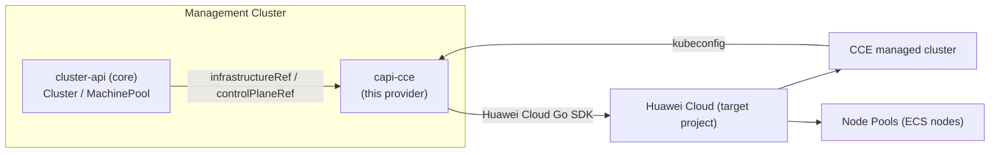

# cloudnative-cluster-api-provider-cce

[](LICENSE)
[](https://www.huaweicloud.com/product/cce.html)
[]()
[]()

> 中文版 / Chinese: [README.zh-CN.md](README.zh-CN.md)

A Cluster API (CAPI) Infrastructure Provider that manages **Huawei Cloud CCE (Cloud Container Engine) managed clusters** declaratively — create, scale and delete CCE clusters and node pools through standard Cluster API resources, aligned with the `CAPI + AWS EKS managed mode` experience.

This provider is for platform engineers and SRE teams who want to manage Huawei Cloud CCE clusters with Kubernetes-native, GitOps-friendly tooling (`kubectl`/`clusterctl`/ArgoCD/Flux), the same way they manage AWS EKS clusters today.

> **Status: incubating (PoC verified).** Architecture and requirements design
> documents are complete; a compilable PoC (CRDs, controllers, services,
> webhooks, manifests) is in place. Cloud-facing behavior has been verified
> against a real Huawei Cloud CCE account (create empty cluster → Available,
> absolute-scale node pools, kubeconfig rotation, delete with cleanup, public
> EIP binding, throttling behavior — see
> [docs/cce-verification-findings.md](docs/cce-verification-findings.md)).
> Unit + envtest controller tests pass. See [docs/](docs/) and
> [docs/requirements-design.md](docs/requirements-design.md).

## Table of Contents

- [Overview](#overview)
- [Repository Layout](#repository-layout)
- [Architecture](#architecture)
- [Highlights](#highlights)
- [Involved Cloud Services & Costs](#involved-cloud-services--costs)
- [Prerequisites](#prerequisites)
- [Quick Start](#quick-start)
- [Step-by-Step Deployment](#step-by-step-deployment)
- [Usage / Verification](#usage--verification)
- [Clean Up Resources](#clean-up-resources)
- [Detailed Documentation](#detailed-documentation)
- [Dependencies & Acknowledgements](#dependencies--acknowledgements)
- [FAQ / Troubleshooting](#faq--troubleshooting)
- [Contributing](#contributing)
- [License](#license)
- [Contact / Maintainers](#contact--maintainers)

## Overview

`cloudnative-cluster-api-provider-cce` translates Cluster API objects (`Cluster`, `MachinePool`) into Huawei Cloud CCE API calls, so you can:

- provision a CCE managed cluster (control plane managed by Huawei Cloud) — **CCE Standard** and **CCE Turbo**;
- manage CCE node pools through `MachinePool` (scale by changing `replicas`);
- obtain a workload-cluster kubeconfig through `clusterctl get kubeconfig`.

It follows the CAPI Provider Contract (namespace-scoped CRDs, version labels, `status.conditions`, finalizers, `clusterctl` packaging) and is published under the Huawei Cloud solution developer kit governance (see [CONTRIBUTING.md](CONTRIBUTING.md) and [docs/](docs/)).

## Repository Layout

```
cloudnative-cluster-api-provider-cce/
├── cmd/                       # program entry
│   └── main.go                #   manager bootstrap (feature gates, controller registration)
├── api/                       # CRD Go types (+kubebuilder markers)
│   ├── common/                #   shared types (VPC/Subnet/Network: reference vs create)
│   ├── controlplane/          #   CCEManagedControlPlane / Template (v1beta2)
│   └── infrastructure/        #   CCECluster / CCEManagedMachinePool / identities (v1beta2)
├── controllers/               # reconcilers
│   ├── ccecluster_controller.go              # CCECluster: network validation / managed network
│   ├── ccemanagedcontrolplane_controller.go  # control plane: CCE cluster lifecycle, kubeconfig, upgrades
│   ├── ccemanagedmachinepool_controller.go   # node pools: CCE node pool lifecycle
│   ├── requeue.go                            # exponential backoff for throttle/quota errors
│   ├── gc.go                                 # orphaned-resource garbage collection (ExternalResourceGC)
│   └── setup.go                              # controller registration
├── internal/                  # private packages
│   ├── conditions/            #   CAPI condition constants/helpers
│   ├── credentials/           #   AK/SK and STS temporary-credential resolution
│   ├── features/              #   feature gates (NodePoolAutoscaling, ExternalResourceGC, ...)
│   ├── metrics/               #   Prometheus metrics
│   ├── scope/                 #   per-reconcile scope (patchHelper pattern)
│   ├── services/              #   Huawei Cloud service layer (SDK wrappers)
│   │   ├── cce/               #     CCE cluster / node-pool / kubeconfig API
│   │   ├── network/           #     VPC/subnet/NAT management + network validator
│   │   ├── iam/               #     trust-agency (委托) management
│   │   └── errors/            #     error classification (throttle/quota/permission)
│   └── wait/                  #   polling/wait utilities
├── config/                    # kustomize deployment manifests
│   ├── crd/                   #   CRD manifests (controller-gen output)
│   ├── default/               #   default overlay (manager + webhook)
│   ├── manager/ rbac/ webhook/#   deployment / RBAC / webhook fragments
│   └── samples/               #   examples: cluster-template.yaml (Standard/Turbo)
├── hack/                      # Go dev/deploy tools (see docs/e2e-deployment-guide.md)
│   ├── deploy-network/        #   VPC / subnets / keypair (deploy guide stage 1, step 1)
│   ├── deploy-bastion/        #   bastion ECS (deploy guide stage 1, step 2)
│   ├── deploy-mgmt-cluster/   #   create/list/delete management cluster (stage 1, step 3)
│   ├── swr-login/             #   SWR temp login token
│   ├── survey-hw/             #   inventory all Huawei Cloud resources
│   ├── cleanup-hw/            #   delete resources by ID
│   └── ...                    #   misc (nat-egress, bind-eip, cleanup-smoke-clusters, ...)
├── scripts/                   # shell scripts
│   ├── deploy-kind.sh         #   one-command local kind deployment
│   ├── smoke-cce.sh           #   real-cloud smoke test
│   └── check-prerequisites.sh
├── test/                      # test support
│   ├── fakes/                 #   fake services (unit tests)
│   ├── e2e/                   #   envtest controller suite
│   └── capi-crds/             #   CAPI CRD manifests (envtest)
├── deploy/                    # deployment scripts (deploy-provider.sh / destroy.sh)
├── docs/                      # design, requirements, deployment guides, verification findings
├── Makefile                   # build / test / manifest generation
├── Dockerfile
└── go.mod
```

Key flows:

- **API → reconciler**: `api/*` types are reconciled by `controllers/*`; each reconcile reads the Huawei Cloud state through `internal/services/*` (SDK wrappers) and persists results via `internal/scope` (patchHelper).
- **Deployment**: `hack/deploy-*` provisions the real cloud (VPC, bastion, management cluster); `scripts/deploy-kind.sh` runs everything locally; the full end-to-end guide is in [docs/e2e-deployment-guide.md](docs/e2e-deployment-guide.md).
- **Smoke test**: `scripts/smoke-cce.sh` + `hack/cleanup-smoke-clusters` drive the real-cloud smoke test, independent of the deploy flow.

## Architecture



Design details: see [docs/architecture-design.md](docs/architecture-design.md) (Chinese) and [docs/research-sources.md](docs/research-sources.md) for the verified facts behind every design decision.

## Highlights

- **Declarative managed clusters** — CCE control plane is fully managed by Huawei Cloud; the provider only translates and reconciles.
- **CCE Standard + CCE Turbo** — both supported (Turbo recommended by default, aligned with the EKS-managed positioning).
- **MachinePool ↔ node pool** — scale via `MachinePool.spec.replicas`; no bootstrap provider required for managed node pools.
- **`clusterctl` compatible** — `metadata.yaml` + `infrastructure-components.yaml` packaging (in progress), `clusterctl describe cluster` / `get kubeconfig` support.
- **GitOps ready** — drive everything from Git via ArgoCD/Flux.
- **CCE access policies (EKS access-entries parity)** — declarative `spec.accessPolicies[]` on the control plane maps IAM users/groups/agencies to CCE permission roles (`CCEClusterAdminPolicy` / `CCEAdminPolicy` / `CCEEditPolicy` / `CCEViewPolicy`) scoped to namespaces.
- **Identity management** — per-cluster `CCEClusterIdentity` (AK/SK Secret or `SecretKey` object reference) and controller-default identity, mirroring CAPA's three identities.
- **Orphaned-resource garbage collection** — opt-in periodic sweeper deletes CCE clusters whose `Cluster` CR no longer exists (mirrors CAPA `ExternalResourceGC`).

## Involved Cloud Services & Costs

| Service | Purpose | Cost note |
|---|---|---|
| CCE (Cloud Container Engine) | Managed Kubernetes clusters (Standard/Turbo) | Cluster + nodes billed on demand (`billingMode: 0`) by default; empty clusters may still incur charges — verify with the pricing page |
| ECS (Elastic Cloud Server) | Worker nodes (managed by CCE node pools) | Billed per node; see node pool `flavor`/`billingMode` |
| VPC / Subnet | Network for cluster and nodes | Provided/referenced by the user; NAT/EIP may apply for egress |
| (Optional) EIP / ELB | Public API server access | Only when `endpointAccess.public` is enabled |

> Always remove test clusters after use (see [Clean Up Resources](#clean-up-resources)) to avoid continued billing.

## Prerequisites

Install the CLI tools first (macOS via [Homebrew](https://brew.sh), Linux via the linked pages):

```bash
brew install docker kind kubectl    # docker: Docker Desktop; kubectl >= v1.28
# clusterctl must be v1.14.x to match the CAPI contract this provider uses
# (the brew formula may lag behind — download the exact release instead):
curl -L https://github.com/kubernetes-sigs/cluster-api/releases/download/v1.14.0/clusterctl-$(uname -s | tr '[:upper:]' '[:lower:]')-$(uname -m | sed 's/x86_64/amd64/;s/aarch64/arm64/') -o clusterctl
chmod +x clusterctl && sudo mv clusterctl /usr/local/bin/
clusterctl version   # should print v1.14.0
```

Cloud-side prerequisites (all in the Huawei Cloud console):

- An IAM user Access Key/Secret Key (AK/SK) with the CCE permissions listed in [docs/smoke-test-checklist.md](docs/smoke-test-checklist.md) §2. **The account must have sufficient balance** — CCE clusters and nodes are billed; an empty balance makes creation fail with `CCE.01429004`.
- An existing VPC and subnet in your region (CCE requires a VPC *before* cluster creation).
- An SSH keypair (ECS → Key Pairs) for the node pool's `sshKey` field.

> A one-command setup script (`scripts/deploy-kind.sh`) automates the fiddly local steps below (image build, kind cluster, webhook certs, `clusterctl init`). See [Quick Start](#quick-start).

## Quick Start

> This flow was verified end-to-end with `clusterctl v1.14.0` on `kind` against a real CCE account (see [docs/clusterctl-deployment-validation.md](docs/clusterctl-deployment-validation.md)). Credentials are provided **only** via a Secret / environment variables — never hardcode them.

**Step A — install the provider on a local kind management cluster** (one command):

```bash
scripts/deploy-kind.sh
# builds the image, creates kind, generates webhook certs + components,
# registers the provider with clusterctl, and runs `clusterctl init`
```

**Step B — create a workload cluster on real CCE:**

```bash
# 1. Per-cluster credentials Secret (name = <clusterName>-credentials)
kubectl create secret generic my-cce-cluster-credentials \
  --namespace default \
  --from-literal=accessKey="$CCE_ACCESS_KEY" \
  --from-literal=secretKey="$CCE_SECRET_KEY"

# 2. Empty bootstrap Secret required by the CAPI v1.14 MachinePool contract
kubectl create secret generic my-cce-cluster-bootstrap \
  --namespace default --from-literal=value=""

# 3. Apply the workload cluster (fill in VERIFY-... placeholders first)
kubectl apply -f config/samples/cluster-template.yaml

# 4. Watch it provision
kubectl get ccemanagedcontrolplane --watch
```

## Step-by-Step Deployment

1. **Build the provider image** (a published release already ships a ready-made image + `infrastructure-components.yaml`; for local development use the default tag):

   ```bash
   make docker-build           # IMG=registry/org/cluster-api-cce-controller:vX.Y.Z for a real registry
   # or, for a local kind dev loop:  docker build -t cluster-api-cce-controller:dev .
   ```

2. **Generate `infrastructure-components.yaml`** (the manifest `clusterctl` installs):

   ```bash
   kubectl kustomize config/default > infrastructure-components.yaml
   ```

   Two requirements that trip up first-time deployments:

   - **Canonical image name.** The manager image must be a three-part name
     (`registry/org/repo:tag`) or `clusterctl init` fails with *"repository name
     must be canonical"*. Override it with a kustomize `images:` transform — see
     `scripts/deploy-kind.sh` for a ready example.
   - **Webhook `caBundle`.** The 14 admission webhooks need
     `clientConfig.caBundle = base64(CA cert)`. With cert-manager this is
     injected automatically; without it you must fill it in (see step 3).

3. **Webhook TLS certificates.** The manager mounts the Secret at
   `/tmp/k8s-webhook-server/serving-certs` (`tls.crt`/`tls.key`). Without
   cert-manager, self-sign a cert whose CN/SANs match the webhook service, then
   create the Secret:

   ```bash
   # CN = webhook-service.capi-cce-system.svc; SANs:
   #   webhook-service, webhook-service.capi-cce-system,
   #   webhook-service.capi-cce-system.svc,
   #   webhook-service.capi-cce-system.svc.cluster.local
   kubectl -n capi-cce-system create secret tls webhook-service-cert \
     --cert=server.crt --key=server.key
   # and inject `caBundle: <base64 of ca.crt>` into every webhook in
   # infrastructure-components.yaml (scripts/deploy-kind.sh does this for you)
   ```

   > RBAC note: the leader-election RoleBinding subject namespace must be the
   > real namespace (`capi-cce-system`); kustomize does not rewrite
   > RoleBinding subjects.

4. **Configure clusterctl and install** (local source before a release is published):

   ```bash
   mkdir -p /tmp/cce/infrastructure-cce/v0.1.0
   cp infrastructure-components.yaml metadata.yaml /tmp/cce/infrastructure-cce/v0.1.0/
   mkdir -p ~/.cluster-api
   cat > ~/.cluster-api/clusterctl.yaml <<'EOF'
   providers:
     - name: "cce"
       url: "file:///tmp/cce/infrastructure-cce/v0.1.0/infrastructure-components.yaml"
       type: "InfrastructureProvider"
   EOF
   clusterctl init --infrastructure cce --wait-providers
   # installs cert-manager + CAPI core + bootstrap-kubeadm + control-plane-kubeadm + infrastructure-cce
   kubectl get pods -A | grep -E 'capi-|cert-manager|cloudnative-cluster-api-provider-cce'   # all Running
   ```

5. **Create the workload cluster** (Cluster + CCECluster + CCEManagedControlPlane + MachinePool + CCEManagedMachinePool — sample in `config/samples/cluster-template.yaml`; fill in every `VERIFY-...` placeholder):
   > **`spec.region` lives on `CCECluster`** — not on `CCEManagedControlPlane`. The control plane has no `region` field; it inherits the region through the owning `Cluster` (the sample already puts it in the right place).

   ```bash
   kubectl create secret generic my-cce-cluster-credentials \
     --namespace default \
     --from-literal=accessKey="$CCE_ACCESS_KEY" \
     --from-literal=secretKey="$CCE_SECRET_KEY"

   # Required by the CAPI v1.14 MachinePool contract (managed pools carry no
   # bootstrap data; the reference just needs to exist)
   kubectl create secret generic my-cce-cluster-bootstrap \
     --namespace default --from-literal=value=""

   kubectl apply -f config/samples/cluster-template.yaml
   kubectl get ccemanagedcontrolplane my-cce-cluster-control-plane -w
   ```

   Expected conditions (all `True`): `CredentialsReady`, `CCEClusterReady`
   (`ClusterAvailable`), `KubeconfigReady`, `AddonsConfigured`,
   `PodIdentityAssociationsConfigured`, `LoggingConfigured`,
   `AccessPoliciesConfigured`, `UpgradeReady`.

6. **Verify and clean up:**

   ```bash
   clusterctl get kubeconfig my-cce-cluster > my-cce-cluster.kubeconfig
   kubectl --kubeconfig my-cce-cluster.kubeconfig get nodes   # == replicas, Ready
   # NOTE: with endpointAccess.public=false the kubeconfig server is an
   # internal VPC IP — reachable only from inside that VPC (a bastion host),
   # not from your laptop.

   kubectl delete cluster my-cce-cluster   # async: node pools -> CCE cluster -> kubeconfig Secret -> finalizers
   ```

> **Adopting an existing cluster:** because creation is idempotent, applying a
> manifest whose `clusterName` matches an existing CCE cluster adopts it
> (same CIDR to trigger the conflict). This is handy when you can't create new
> billed resources (e.g. empty account balance).

## Usage / Verification

```bash
# Verify cluster health
clusterctl describe cluster my-cluster

# Get the workload cluster kubeconfig
clusterctl get kubeconfig my-cluster > my-cluster.kubeconfig
kubectl --kubeconfig my-cluster.kubeconfig get nodes
```

Expected result: `kubectl get nodes` shows the number of nodes equal to `MachinePool.spec.replicas`, all `Ready`.

### Conditions (planning-doc naming → provider)

The provider reports finer-grained, CAPA-style conditions than the planning
doc's four aggregate conditions. Mapping:

| Planning doc | Provider condition(s) | Where |
|---|---|---|
| `ClusterReady` | `CCEClusterReady` (`ClusterAvailable`) | CCEManagedControlPlane |
| `ControlPlaneReady` | `CredentialsReady` → `CCEClusterReady` → `KubeconfigReady` → `AddonsConfigured` → `PodIdentityAssociationsConfigured` → `LoggingConfigured` → `AccessPoliciesConfigured` → `UpgradeReady` | CCEManagedControlPlane |
| `NetworkReady` | `NetworkReady` (plus `VpcReady`/`SubnetsReady`/`NatGatewaysReady`/`SecurityGroupsReady`) | CCECluster |
| `NodePoolsReady` | per-pool `NodePoolReady` (no aggregate — CAPI aggregates MachinePool readiness) | CCEManagedMachinePool |

### Cluster upgrades (FR-1.7)

Set `CCEManagedControlPlane.spec.version` to a higher Kubernetes version; the
provider drives the CCE upgrade workflow (pre-check → in-place rolling
upgrade → post-check) and reports progress via the `UpgradeReady` condition.
Note: the platform decides which upgrade targets it offers — when none are
available the condition reports `UpgradeNotOffered` (a normal state, not an
error; see `docs/cce-verification-findings.md` Q11).

### Node pool autoscaling (Alpha, feature gate)

`spec.autoscaling` (enable/min/max) on `CCEManagedMachinePool` is only honored
when the `NodePoolAutoscaling` feature gate is on:

```bash
manager --feature-gates=NodePoolAutoscaling=true
```

It stays Alpha + off-by-default on purpose: node count is normally driven
solely by CAPI `MachinePool.spec.replicas` (a single, predictable source of
truth). Enabling autoscaling hands load-based scaling to CCE's cluster
autoscaler, which coexists with `replicas` (verified Q3/B3) but requires the
external-autoscaler annotation (`cluster.x-k8s.io/replicas-managed-by`) on the
MachinePool so the provider reverse-syncs `replicas` from the cloud instead of
fighting the autoscaler.

### Flavor allowlist (webhook)

`CCEManagedMachinePool.spec.flavor` is validated against the ECS flavor naming
pattern; an optional allowlist can be enforced per deployment (region-specific):

```bash
manager --valid-flavors=c6.large.2,c7.large.2
```

### Access policies (EKS access-entries parity)

`CCEManagedControlPlane.spec.accessPolicies` maps IAM principals to CCE roles:

```yaml
spec:
  accessPolicies:
    - name: dev-view
      policyType: CCEViewPolicy
      principalType: group
      principalIds: ["<iam-group-id>"]
      namespaces: ["*"]
```

Reported by the `AccessPoliciesConfigured` condition.

### Cluster identity (feature gate)

`AutoControllerIdentityCreator` creates the `CCEClusterControllerIdentity`
singleton named `default` (mirrors CAPA `AutoControllerIdentityCreator`). Off
by default:

```bash
manager --feature-gates=AutoControllerIdentityCreator=true
```

### External resource GC (feature gate)

`ExternalResourceGC` enables the periodic orphaned-cluster sweeper: CCE clusters
carrying the owned tag whose `Cluster` CR no longer exists are deleted
(mirrors CAPA `ExternalResourceGC`). Off by default; requires a region:

```bash
manager --feature-gates=ExternalResourceGC=true --gc-region=cn-north-4 [--gc-interval=1h]
```

## Clean Up Resources

```bash
# Delete the workload cluster (removes CCE cluster, node pools, and provider-owned resources)
kubectl delete cluster my-cluster

# Optionally remove the provider from the management cluster
clusterctl delete --infrastructure cce
```

> Deleting the `Cluster` object triggers dependent deletion (node pools → cluster → kubeconfig Secret). Verify no EIP/EVS/ELB leftovers in the CCE console afterwards.

## Detailed Documentation

- [Architecture design (Chinese)](docs/architecture-design.md)
- [Requirements design (Chinese)](docs/requirements-design.md)
- [Research sources & verification checklist (Chinese)](docs/research-sources.md)
- [Huawei Cloud CCE alignment questionnaire](docs/archive/cce-verification-questionnaire.md) · [verification findings](docs/cce-verification-findings.md)
- [clusterctl deployment validation (kind + real CCE)](docs/clusterctl-deployment-validation.md)
- [Official API reference review findings](docs/archive/api-review-findings.md)
- [Full code audit findings](docs/archive/code-audit-findings.md)
- [CAPA parity gap analysis (against CAPA v2.13.0 / CAPI v1.14.0)](docs/capa-alignment-final-summary.md)
- [CAPA code analysis](docs/archive/CAPA架构分析报告.md) · [Alibaba ACK provider code analysis](docs/archive/ACKProvider架构分析报告.md) · [CAPHW code analysis](docs/archive/CAPHW架构分析报告.md)

## Dependencies & Acknowledgements

- [Cluster API](https://cluster-api.sigs.k8s.io/) (`sigs.k8s.io/cluster-api`) — core contracts and controllers.
- [controller-runtime](https://github.com/kubernetes-sigs/controller-runtime) — reconciler framework.
- [Huawei Cloud Go SDK](https://github.com/huaweicloud/huaweicloud-sdk-go-v3) — CCE/ECS/VPC clients.
- Reference implementations studied: [cluster-api-provider-aws](https://github.com/kubernetes-sigs/cluster-api-provider-aws), [alibabacloud-provider-for-Cluster-API](https://github.com/AliyunContainerService/alibabacloud-provider-for-Cluster-API), [cluster-api-provider-huawei](https://github.com/huaweicloud-samples/cluster-api-provider-huawei).

## FAQ / Troubleshooting

- **`clusterctl init` fails with *"repository name must be canonical"*** — the manager image in `infrastructure-components.yaml` is not a three-part `registry/org/repo:tag` name. Override it with a kustomize `images:` transform (see `scripts/deploy-kind.sh`).
- **`capi-cce-controller-manager` stuck in `ContainerCreating` with "secret webhook-service-cert not found"** — create the webhook TLS Secret (`kubectl -n capi-cce-system create secret tls webhook-service-cert --cert=server.crt --key=server.key`) and restart the deployment.
- **`cert-manager` pods `ImagePullBackOff` (or any image pull fails on kind)** — your shell's `HTTP_PROXY`/`HTTPS_PROXY` env vars (e.g. a dead `127.0.0.1:7890` proxy) are inherited by the kind node's containerd. Recreate the cluster with the proxy vars unset: `env -u http_proxy -u https_proxy kind create cluster ...`.
- **Cluster creation fails with `APIGW.0308` (429 throttling)** — Huawei Cloud limits write API calls (observed 10/minute). The controller backs off and retries automatically; just wait. (The same message appears transiently right after many rapid create attempts.)
- **Cluster creation fails with `CCE.01429004 Insufficient account balance`** — the account has no balance to create billed CCE resources. Top up the account, or adopt an existing cluster instead (see the note at the end of Step-by-Step Deployment).
- **Cluster creation fails with `CCE_CM.0004 "Tag's parameters is invalid"`** — a tag key/value violates CCE's constraints (key charset `_.:=+-@` etc., no `/`). Use a provider version ≥ the one that fixed the owned-tag key.
- **`kubectl --kubeconfig ...` reports "unable to parse bytes as PEM block"** — older provider builds double-encoded the kubeconfig CA; rebuild/upgrade to a fixed version.
- **`MachinePool` rejected: "spec.template.spec.bootstrap: Required value"** — CAPI v1.14 requires a bootstrap reference on every MachinePool. Add `bootstrap.dataSecretName: <cluster>-bootstrap` (an empty Secret is fine for managed node pools).
- **Node pool creation fails with `OS: should not be empty`** — in practice CCE requires an explicit `os` even though the API doc says it auto-selects. It is **not a single value**: valid images for current cluster versions include `Huawei Cloud EulerOS 2.0`, `EulerOS release 2.9`, `Ubuntu 22.04`, `Huawei Cloud EulerOS 1.1` (exact string matters; see the official [node OS list](https://support.huaweicloud.com/usermanual-cce/cce_10_0476.html) and the commented list in `config/samples/cluster-template.yaml`).
- **Cluster creation fails with a network error** — CCE requires an existing VPC and non-overlapping container/service CIDRs; verify `spec.network` and the CIDR plan (see [docs/architecture-design.md](docs/architecture-design.md) §6). Container CIDRs must be unique *per VPC*.
- **Node pool does not scale** — confirm the control plane is `Ready` (node pools are only created after the cluster is `Available`) and that the IAM user has `cce:nodepool:scale`.
- **`clusterctl get kubeconfig` returns an unreachable server** — for private clusters (`endpointAccess.public: false`) the kubeconfig server is an internal VPC IP; reach it from a host inside the VPC.
- **Where is `region` configured?** — on `CCECluster.spec.region` (the infrastructure cluster), **not** on `CCEManagedControlPlane`. The control plane resolves the region through the owning `Cluster`; see `config/samples/cluster-template.yaml`.
- More: [docs/requirements-design.md](docs/requirements-design.md) §8 (cautions) and the [verification checklist](docs/research-sources.md) §4.

## Contributing

See [CONTRIBUTING.md](CONTRIBUTING.md). All commits must be DCO-signed (`git commit -s`).

## License

This project is licensed under the [MIT No Attribution (MIT-0)](LICENSE) license.

## Contact / Maintainers

- Maintainer: <your-team@huaweicloud.com> (placeholder — to be updated at repo creation)
- Discussion: GitHub Issues / [Huawei Cloud Developer Community](https://developer.huaweicloud.com/)
