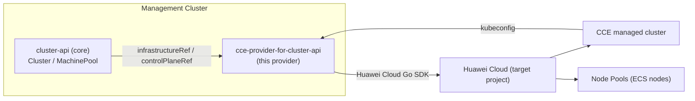

# cloudnative-cluster-api-provider-cce

[](LICENSE)
[](https://www.huaweicloud.com/product/cce.html)
[]()
[]()

> 中文版 / Chinese: [README.zh-CN.md](README.zh-CN.md)

A Cluster API (CAPI) Infrastructure Provider that manages **Huawei Cloud CCE (Cloud Container Engine) managed clusters** declaratively — create, scale and delete CCE clusters and node pools through standard Cluster API resources, aligned with the `CAPI + AWS EKS managed mode` experience.

This provider is for platform engineers and SRE teams who want to manage Huawei Cloud CCE clusters with Kubernetes-native, GitOps-friendly tooling (`kubectl`/`clusterctl`/ArgoCD/Flux), the same way they manage AWS EKS clusters today.

> **Status: incubating (PoC skeleton).** Architecture and requirements design
> documents are complete; a compilable PoC skeleton (CRDs, controllers,
> services, webhooks, manifests) is in place. Cloud-facing behavior is behind
> interfaces and flagged for verification against Huawei Cloud CCE. See
> [docs/](docs/) and [docs/requirements-design.md](docs/requirements-design.md).

## Table of Contents

- [Overview](#overview)
- [Architecture](#architecture)
- [Highlights](#highlights)
- [Involved Cloud Services & Costs](#involved-cloud-services--costs)
- [Prerequisites](#prerequisites)
- [Quick Start](#quick-start)
- [Step-by-Step Deployment](#step-by-step-deployment)
- [Usage / Verification](#usage--verification)
- [Clean Up Resources](#clean-up-resources)
- [Detailed Documentation](#detailed-documentation)
- [Dependencies & Acknowledgements](#dependencies--acknowledgements)
- [FAQ / Troubleshooting](#faq--troubleshooting)
- [Contributing](#contributing)
- [License](#license)
- [Contact / Maintainers](#contact--maintainers)

## Overview

`cloudnative-cluster-api-provider-cce` translates Cluster API objects (`Cluster`, `MachinePool`) into Huawei Cloud CCE API calls, so you can:

- provision a CCE managed cluster (control plane managed by Huawei Cloud) — **CCE Standard** and **CCE Turbo**;
- manage CCE node pools through `MachinePool` (scale by changing `replicas`);
- obtain a workload-cluster kubeconfig through `clusterctl get kubeconfig`.

It follows the CAPI Provider Contract (namespace-scoped CRDs, version labels, `status.conditions`, finalizers, `clusterctl` packaging) and is published under the Huawei Cloud solution developer kit governance (see [CONTRIBUTING.md](CONTRIBUTING.md) and [docs/](docs/)).

## Architecture



Design details: see [docs/architecture-design.md](docs/architecture-design.md) (Chinese) and [docs/research-sources.md](docs/research-sources.md) for the verified facts behind every design decision.

## Highlights

- **Declarative managed clusters** — CCE control plane is fully managed by Huawei Cloud; the provider only translates and reconciles.
- **CCE Standard + CCE Turbo** — both supported (Turbo recommended by default, aligned with the EKS-managed positioning).
- **MachinePool ↔ node pool** — scale via `MachinePool.spec.replicas`; no bootstrap provider required for managed node pools.
- **`clusterctl` compatible** — `metadata.yaml` + `infrastructure-components.yaml` packaging (in progress), `clusterctl describe cluster` / `get kubeconfig` support.
- **GitOps ready** — drive everything from Git via ArgoCD/Flux.

## Involved Cloud Services & Costs

| Service | Purpose | Cost note |
|---|---|---|
| CCE (Cloud Container Engine) | Managed Kubernetes clusters (Standard/Turbo) | Cluster + nodes billed on demand (`billingMode: 0`) by default; empty clusters may still incur charges — verify with the pricing page |
| ECS (Elastic Cloud Server) | Worker nodes (managed by CCE node pools) | Billed per node; see node pool `flavor`/`billingMode` |
| VPC / Subnet | Network for cluster and nodes | Provided/referenced by the user; NAT/EIP may apply for egress |
| (Optional) EIP / ELB | Public API server access | Only when `endpointAccess.public` is enabled |

> Always remove test clusters after use (see [Clean Up Resources](#clean-up-resources)) to avoid continued billing.

## Prerequisites

- A Huawei Cloud account with an IAM user/agency having at least the CCE permissions required by the provider (see [docs/requirements-design.md](docs/requirements-design.md) §8.1 and the [verification checklist](docs/research-sources.md) — **minimum permissions are still to be confirmed with Huawei Cloud**).
- An existing VPC and subnet(s) for the cluster (CCE requires a VPC before cluster creation).
- A Kubernetes management cluster (`kind` or a dedicated cluster) with `clusterctl` v1.x installed.
- `kubectl` configured for the management cluster.

## Quick Start

> The provider is under development; the following flow becomes executable once a release is published. Credentials are provided **only** through environment variables — never hardcode them.

```bash
# 1. Install the provider on the management cluster
export CCE_ACCESS_KEY=... CCE_SECRET_KEY=...
clusterctl init --infrastructure cce

# 2. Apply a workload cluster manifest (see config/samples/ after implementation)
kubectl apply -f cluster-template.yaml
```

## Step-by-Step Deployment

1. Prepare credentials Secret for the target project (per-cluster recommended):

   ```bash
   kubectl create secret generic my-cluster-credentials \
     --namespace default \
     --from-literal=accessKey="$CCE_ACCESS_KEY" \
     --from-literal=secretKey="$CCE_SECRET_KEY"
   ```

2. Create the workload cluster definition (Cluster + CceCluster + CceManagedControlPlane + MachinePool + CceManagedMachinePool). A sample is planned under `config/samples/`.

3. Apply and watch:

   ```bash
   kubectl apply -f workload-cluster.yaml
   kubectl get cluster --watch
   ```

4. When `Phase` becomes `Provisioned`, fetch the kubeconfig (see [Usage / Verification](#usage--verification)).

## Usage / Verification

```bash
# Verify cluster health
clusterctl describe cluster my-cluster

# Get the workload cluster kubeconfig
clusterctl get kubeconfig my-cluster > my-cluster.kubeconfig
kubectl --kubeconfig my-cluster.kubeconfig get nodes
```

Expected result: `kubectl get nodes` shows the number of nodes equal to `MachinePool.spec.replicas`, all `Ready`.

## Clean Up Resources

```bash
# Delete the workload cluster (removes CCE cluster, node pools, and provider-owned resources)
kubectl delete cluster my-cluster

# Optionally remove the provider from the management cluster
clusterctl delete --infrastructure cce
```

> Deleting the `Cluster` object triggers dependent deletion (node pools → cluster → kubeconfig Secret). Verify no EIP/EVS/ELB leftovers in the CCE console afterwards.

## Detailed Documentation

- [Architecture design (Chinese)](docs/architecture-design.md)
- [Requirements design (Chinese)](docs/requirements-design.md)
- [Research sources & verification checklist (Chinese)](docs/research-sources.md)
- [CAPA code analysis](docs/CAPA架构分析报告.md) · [Alibaba ACK provider code analysis](docs/ACKProvider架构分析报告.md) · [CAPHW code analysis](docs/CAPHW架构分析报告.md)

## Dependencies & Acknowledgements

- [Cluster API](https://cluster-api.sigs.k8s.io/) (`sigs.k8s.io/cluster-api`) — core contracts and controllers.
- [controller-runtime](https://github.com/kubernetes-sigs/controller-runtime) — reconciler framework.
- [Huawei Cloud Go SDK](https://github.com/huaweicloud/huaweicloud-sdk-go-v3) — CCE/ECS/VPC clients.
- Reference implementations studied: [cluster-api-provider-aws](https://github.com/kubernetes-sigs/cluster-api-provider-aws), [alibabacloud-provider-for-Cluster-API](https://github.com/AliyunContainerService/alibabacloud-provider-for-Cluster-API), [cluster-api-provider-huawei](https://github.com/huaweicloud-samples/cluster-api-provider-huawei).

## FAQ / Troubleshooting

- **Cluster creation fails with a network error** — CCE requires an existing VPC and non-overlapping container/service CIDRs; verify `spec.network` and the CIDR plan (see [docs/architecture-design.md](docs/architecture-design.md) §6).
- **Node pool does not scale** — confirm the control plane is `Ready` (node pools are only created after the cluster is `Available`) and that the IAM user has `cce:nodepool:scale`.
- **`clusterctl get kubeconfig` returns an unreachable server** — for private clusters the kubeconfig server is an internal endpoint; make sure the management cluster can reach it.
- More: [docs/requirements-design.md](docs/requirements-design.md) §8 (cautions) and the [verification checklist](docs/research-sources.md) §4.

## Contributing

See [CONTRIBUTING.md](CONTRIBUTING.md). All commits must be DCO-signed (`git commit -s`).

## License

This project is licensed under the [MIT No Attribution (MIT-0)](LICENSE) license.

## Contact / Maintainers

- Maintainer: <your-team@huaweicloud.com> (placeholder — to be updated at repo creation)
- Discussion: GitHub Issues / [Huawei Cloud Developer Community](https://developer.huaweicloud.com/)
