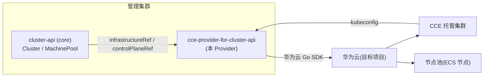

# cloudnative-cluster-api-provider-cce

[](LICENSE)
[](https://www.huaweicloud.com/product/cce.html)
[]()
[]()

> 英文版 / English: [README.md](README.md)

一个用于管理**华为云 CCE(云容器引擎)托管集群**的 Cluster API(CAPI)基础设施 Provider——通过标准的 Cluster API 资源以声明式方式创建、扩缩容和删除 CCE 集群与节点池,对标 `CAPI + AWS EKS 托管模式` 的使用体验。

本项目面向平台工程师与 SRE 团队,帮助他们用 Kubernetes 原生、适合 GitOps 的工具链(`kubectl` / `clusterctl` / ArgoCD / Flux)管理华为云 CCE 集群,就像今天管理 AWS EKS 集群一样。

> **状态:incubating(PoC 已验证)。** 架构设计与需求设计文档已完成;可编译的 PoC(CRD、控制器、服务层、webhook、部署清单)已就位。云侧行为已在真实华为云 CCE 账号上验证通过(空集群创建→Available、节点池绝对值扩缩容、kubeconfig 轮换、带清理的删除、公网 EIP 绑定、限流行为——详见 [docs/cce-verification-findings.md](docs/cce-verification-findings.md))。单元测试与 envtest 控制器测试全部通过。参见 [docs/](docs/) 与[需求文档](docs/requirements-design.md)中的路线图。

## 目录

- [概述](#概述)
- [架构](#架构)
- [方案亮点](#方案亮点)
- [涉及云服务与费用](#涉及云服务与费用)
- [前置条件](#前置条件)
- [快速开始](#快速开始)
- [分步部署](#分步部署)
- [使用方法 / 验证](#使用方法--验证)
- [清理资源](#清理资源)
- [详细文档](#详细文档)
- [依赖与致谢](#依赖与致谢)
- [FAQ / 故障排除](#faq--故障排除)
- [贡献指南](#贡献指南)
- [许可证](#许可证)
- [联系方式 / 维护者](#联系方式--维护者)

## 概述

`cloudnative-cluster-api-provider-cce` 将 Cluster API 对象(`Cluster`、`MachinePool`)翻译为华为云 CCE API 调用,使您可以:

- 创建 CCE 托管集群(控制面由华为云托管)——支持 **CCE Standard** 与 **CCE Turbo**;
- 通过 `MachinePool` 管理 CCE 节点池(修改 `replicas` 即可扩缩容);
- 通过 `clusterctl get kubeconfig` 获取工作集群的 kubeconfig。

它遵循 CAPI Provider 合约(namespace 级 CRD、版本标签、`status.conditions`、finalizer、`clusterctl` 打包),并按照华为云解决方案开发者套件治理规范发布(见 [CONTRIBUTING.md](CONTRIBUTING.md) 与 [docs/](docs/))。

## 架构



设计细节:参见 [docs/architecture-design.md](docs/architecture-design.md) 与 [docs/research-sources.md](docs/research-sources.md)(每个设计决策背后的事实依据)。

## 方案亮点

- **声明式管理托管集群**——CCE 控制面完全由华为云托管,Provider 只负责翻译与调谐。
- **CCE Standard + CCE Turbo 双支持**——两者都支持(默认推荐 Turbo,与 EKS 托管定位对齐)。
- **MachinePool ↔ 节点池**——通过 `MachinePool.spec.replicas` 扩缩容;托管节点池无需 bootstrap provider。
- **兼容 `clusterctl`**——`metadata.yaml` + `infrastructure-components.yaml` 打包(进行中),支持 `clusterctl describe cluster` / `get kubeconfig`。
- **GitOps 就绪**——通过 ArgoCD/Flux 从 Git 全流程驱动。

## 涉及云服务与费用

| 服务 | 用途 | 费用说明 |
|---|---|---|
| CCE(云容器引擎) | 托管 Kubernetes 集群(Standard/Turbo) | 默认按需计费(`billingMode: 0`);空集群也可能产生费用,请以价格页为准 |
| ECS(弹性云服务器) | 工作节点(由 CCE 节点池管理) | 按节点计费,见节点池 `flavor` / `billingMode` |
| VPC / 子网 | 集群与节点的网络 | 由用户提供/引用;出网可能需要 NAT/EIP |
| (可选)EIP / ELB | 公网访问 API Server | 仅当开启 `endpointAccess.public` 时 |

> 测试集群使用后务必清理(见[清理资源](#清理资源)),避免持续计费。

## 前置条件

先安装命令行工具(macOS 用 [Homebrew](https://brew.sh),Linux 参见链接页面):

```bash
brew install docker kind kubectl    # docker: Docker Desktop;kubectl >= v1.28
# clusterctl 必须用 v1.14.x(与本 Provider 使用的 CAPI 合约匹配;brew 公式可能滞后,建议直接下载对应版本):
curl -L https://github.com/kubernetes-sigs/cluster-api/releases/download/v1.14.0/clusterctl-$(uname -s | tr '[:upper:]' '[:lower:]')-$(uname -m | sed 's/x86_64/amd64/;s/aarch64/arm64/') -o clusterctl
chmod +x clusterctl && sudo mv clusterctl /usr/local/bin/
clusterctl version   # 应显示 v1.14.0
```

云侧前置条件(均在华为云控制台完成):

- 一个 IAM 用户的访问密钥对(AK/SK),具备 [docs/smoke-test-checklist.md](docs/smoke-test-checklist.md) §2 所列的 CCE 权限。**账户必须有足够余额**——CCE 集群与节点按需计费,余额不足时创建会报 `CCE.01429004`。
- 目标区域已有 VPC 和子网(CCE 创建集群前必须存在 VPC)。
- 一个 SSH 密钥对(ECS → 密钥对),用于节点池的 `sshKey` 字段。

> 提供了一键脚本 `scripts/deploy-kind.sh`,自动完成以下繁琐的本地步骤(镜像构建、kind 集群、webhook 证书、`clusterctl init`)。见[快速开始](#快速开始)。

## 快速开始

> 以下完整流程已用 `clusterctl v1.14.0` + `kind` + 真实华为云 CCE 账号端到端验证通过(详见 [docs/clusterctl-deployment-validation.md](docs/clusterctl-deployment-validation.md))。凭证**只能**通过 Secret / 环境变量提供——切勿硬编码。

**步骤 A — 在本地 kind 管理集群安装 Provider**(一条命令):

```bash
scripts/deploy-kind.sh
# 构建镜像、创建 kind、生成 webhook 证书与组件清单、
# 向 clusterctl 注册 Provider,并执行 `clusterctl init`
```

**步骤 B — 在真实 CCE 上创建工作负载集群:**

```bash
# 1. 每集群凭证 Secret(名称 = <clusterName>-credentials)
kubectl create secret generic my-cce-cluster-credentials \
  --namespace default \
  --from-literal=accessKey="$CCE_ACCESS_KEY" \
  --from-literal=secretKey="$CCE_SECRET_KEY"

# 2. CAPI v1.14 MachinePool 合约要求的空 bootstrap Secret
kubectl create secret generic my-cce-cluster-bootstrap \
  --namespace default --from-literal=value=""

# 3. 应用工作集群(先填好所有 VERIFY-... 占位符)
kubectl apply -f config/samples/cluster-template.yaml

# 4. 观察创建进度
kubectl get ccemanagedcontrolplane --watch
```

## 分步部署

1. **构建 Provider 镜像**(每个版本一次;正式发布会直接附带现成镜像 + `infrastructure-components.yaml`):

   ```bash
   make docker-build           # 推送到真实仓库时 IMG=registry/org/cce-provider-controller:vX.Y.Z
   # 本地 kind 开发循环用:docker build -t cce-provider-controller:dev .
   ```

2. **生成 `infrastructure-components.yaml`**(`clusterctl` 安装用的清单):

   ```bash
   kubectl kustomize config/default > infrastructure-components.yaml
   ```

   初次部署最容易踩的两个坑:

   - **规范镜像名**。manager 镜像必须是三段式名称(`registry/org/repo:tag`),否则 `clusterctl init` 报 *"repository name must be canonical"*。用 kustomize 的 `images:` 转换覆盖(现成示例见 `scripts/deploy-kind.sh`)。
   - **Webhook `caBundle`**。6 个准入 webhook 需要 `clientConfig.caBundle = base64(CA 证书)`;cert-manager 会自动注入,否则需手动填充(见步骤 3)。

3. **Webhook TLS 证书**。manager 挂载 `/tmp/k8s-webhook-server/serving-certs`(`tls.crt`/`tls.key`)处的 Secret。不使用 cert-manager 时,自签一张 CN/SAN 匹配 webhook 服务的证书并创建 Secret:

   ```bash
   # CN = webhook-service.cce-provider-system.svc;SAN:
   #   webhook-service、webhook-service.cce-provider-system、
   #   webhook-service.cce-provider-system.svc、
   #   webhook-service.cce-provider-system.svc.cluster.local
   kubectl -n cce-provider-system create secret tls webhook-service-cert \
     --cert=server.crt --key=server.key
   # 并把 `caBundle: <ca.crt 的 base64>` 注入 infrastructure-components.yaml 的每个 webhook
   # (scripts/deploy-kind.sh 已为你自动完成)
   ```

   > RBAC 注意:leader-election RoleBinding 的 subject.namespace 必须是真实命名空间(`cce-provider-system`);kustomize 不会改写 RoleBinding 的 subjects。

4. **配置 clusterctl 并安装**(发布前使用本地源):

   ```bash
   mkdir -p /tmp/cce/infrastructure-cce/v0.1.0
   cp infrastructure-components.yaml metadata.yaml /tmp/cce/infrastructure-cce/v0.1.0/
   mkdir -p ~/.cluster-api
   cat > ~/.cluster-api/clusterctl.yaml <<'EOF'
   providers:
     - name: "cce"
       url: "file:///tmp/cce/infrastructure-cce/v0.1.0/infrastructure-components.yaml"
       type: "InfrastructureProvider"
   EOF
   clusterctl init --infrastructure cce --wait-providers
   # 会安装 cert-manager + CAPI 核心 + bootstrap-kubeadm + control-plane-kubeadm + infrastructure-cce
   kubectl get pods -A | grep -E 'capi-|cert-manager|cce-provider'   # 全部 Running
   ```

5. **创建工作集群**(Cluster + CCECluster + CCEManagedControlPlane + MachinePool + CCEManagedMachinePool;样例见 `config/samples/cluster-template.yaml`,填好每个 `VERIFY-...` 占位符):

   ```bash
   kubectl create secret generic my-cce-cluster-credentials \
     --namespace default \
     --from-literal=accessKey="$CCE_ACCESS_KEY" \
     --from-literal=secretKey="$CCE_SECRET_KEY"

   # CAPI v1.14 MachinePool 合约要求(托管节点池无需引导数据,仅需该引用存在)
   kubectl create secret generic my-cce-cluster-bootstrap \
     --namespace default --from-literal=value=""

   kubectl apply -f config/samples/cluster-template.yaml
   kubectl get ccemanagedcontrolplane my-cce-cluster-control-plane -w
   ```

   预期条件(全部 `True`):`CredentialsReady`、`CCEClusterReady`(`ClusterAvailable`)、`KubeconfigReady`、`AddonsConfigured`、`PodIdentityAssociationsConfigured`、`LoggingConfigured`、`UpgradeReady`。

6. **验证与清理:**

   ```bash
   clusterctl get kubeconfig my-cce-cluster > my-cce-cluster.kubeconfig
   kubectl --kubeconfig my-cce-cluster.kubeconfig get nodes   # == replicas,全部 Ready
   # 注意:endpointAccess.public=false 时,kubeconfig 的 server 是内网 VPC IP——
   # 只能从该 VPC 内(如跳板机)访问,你的笔记本无法直连。

   kubectl delete cluster my-cce-cluster   # 异步:节点池 → CCE 集群 → kubeconfig Secret → finalizer
   ```

> **接管已有集群:** 由于创建是幂等的,应用一份 `clusterName` 与已有 CCE 集群同名的清单即可接管它(网段一致以触发冲突)。当无法新建计费资源(如账户余额不足)时,此方式非常实用。

## 使用方法 / 验证

```bash
# 验证集群健康
clusterctl describe cluster my-cluster

# 获取工作集群 kubeconfig
clusterctl get kubeconfig my-cluster > my-cluster.kubeconfig
kubectl --kubeconfig my-cluster.kubeconfig get nodes
```

预期结果:`kubectl get nodes` 显示的节点数等于 `MachinePool.spec.replicas`,且全部 `Ready`。

### 集群升级(FR-1.7)

将 `CCEManagedControlPlane.spec.version` 改为更高的 Kubernetes 版本,Provider 将驱动 CCE 升级工作流(升级前检查 → 原地滚动升级 → 升级后检查),并通过 `UpgradeReady` 条件报告进度。注意:平台决定可升级的目标版本——当无可升级目标时,条件报告 `UpgradeNotOffered`(属正常状态而非错误;详见 `docs/cce-verification-findings.md` Q11)。

### 节点池自动伸缩(Alpha,功能开关)

`CCEManagedMachinePool.spec.autoscaling`(enable/min/max)仅在开启 `NodePoolAutoscaling` 功能开关时生效:

```bash
manager --feature-gates=NodePoolAutoscaling=true
```

### 规格白名单(webhook)

`CCEManagedMachinePool.spec.flavor` 会按 ECS 规格命名规则做格式校验;可按部署(分 region)注入可选白名单:

```bash
manager --valid-flavors=c6.large.2,c7.large.2
```

## 清理资源

```bash
# 删除工作集群(删除 CCE 集群、节点池与 Provider 持有的资源)
kubectl delete cluster my-cluster

# 可选:从管理集群卸载 Provider
clusterctl delete --infrastructure cce
```

> 删除 `Cluster` 对象会触发依赖删除(节点池 → 集群 → kubeconfig Secret)。删除后在 CCE 控制台确认无 EIP/EVS/ELB 残留。

## 详细文档

- [架构设计文档](docs/architecture-design.md)
- [需求设计文档](docs/requirements-design.md)
- [调研依据与事实清单(含验证清单)](docs/research-sources.md)
- [华为云 CCE 对齐问卷](docs/cce-verification-questionnaire.md) · [验证结论记录](docs/cce-verification-findings.md)
- [clusterctl 部署演练记录(kind + 真实 CCE)](docs/clusterctl-deployment-validation.md)
- [官方 API 参考文档审查记录](docs/api-review-findings.md)
- [全量代码审计记录](docs/code-audit-findings.md)
- [CAPA 能力对标差距分析](docs/capa-parity-gap-analysis.md)
- [CAPA 源码分析报告](docs/CAPA架构分析报告.md) · [阿里云 ACK Provider 源码分析报告](docs/ACKProvider架构分析报告.md) · [CAPHW 源码分析报告](docs/CAPHW架构分析报告.md)

## 依赖与致谢

- [Cluster API](https://cluster-api.sigs.k8s.io/)(`sigs.k8s.io/cluster-api`)——核心合约与控制器。
- [controller-runtime](https://github.com/kubernetes-sigs/controller-runtime)——Reconciler 框架。
- [华为云 Go SDK](https://github.com/huaweicloud/huaweicloud-sdk-go-v3)——CCE/ECS/VPC 客户端。
- 参考实现:[cluster-api-provider-aws](https://github.com/kubernetes-sigs/cluster-api-provider-aws)、[alibabacloud-provider-for-Cluster-API](https://github.com/AliyunContainerService/alibabacloud-provider-for-Cluster-API)、[cluster-api-provider-huawei](https://github.com/huaweicloud-samples/cluster-api-provider-huawei)。

## FAQ / 故障排除

- **`clusterctl init` 报 *"repository name must be canonical"*** —— `infrastructure-components.yaml` 中 manager 镜像不是三段式 `registry/org/repo:tag` 名称。用 kustomize 的 `images:` 转换覆盖(见 `scripts/deploy-kind.sh`)。
- **`cce-provider-controller-manager` 卡在 `ContainerCreating`,报 "secret webhook-service-cert not found"** —— 创建 webhook TLS Secret(`kubectl -n cce-provider-system create secret tls webhook-service-cert --cert=server.crt --key=server.key`)并重启 Deployment。
- **`cert-manager` pod `ImagePullBackOff`(或 kind 上任何镜像拉取失败)** —— 你 shell 里的 `HTTP_PROXY`/`HTTPS_PROXY`(如失效的 `127.0.0.1:7890` 代理)被 kind 节点的 containerd 继承。去掉代理变量重建集群:`env -u http_proxy -u https_proxy kind create cluster ...`。
- **集群创建报 `APIGW.0308`(429 限流)** —— 华为云限制写类 API 频率(实测 10 次/分钟)。控制器会自动退避重试,稍等即可(连续大量创建尝试后也会短暂出现此错误)。
- **集群创建报 `CCE.01429004 Insufficient account balance`** —— 账户余额不足,无法创建计费的 CCE 资源。请充值,或改用接管已有集群的方式(见"分步部署"末尾说明)。
- **集群创建报 `CCE_CM.0004 "Tag's parameters is invalid"`** —— 某个标签 key/value 违反 CCE 约束(key 字符集 `_.:=+-@` 等,不允许 `/`)。请使用已修复 owned-tag key 的版本。
- **`kubectl --kubeconfig ...` 报 "unable to parse bytes as PEM block"** —— 旧版本 Provider 对 kubeconfig CA 做了双重 base64 编码;请升级到修复后的版本。
- **`MachinePool` 被拒:"spec.template.spec.bootstrap: Required value"** —— CAPI v1.14 要求每个 MachinePool 都有 bootstrap 引用。添加 `bootstrap.dataSecretName: <cluster>-bootstrap`(托管节点池用空 Secret 即可)。
- **节点池创建报 `OS: should not be empty`** —— 实测 CCE 要求显式指定 `os`(尽管 API 文档称会自动选择)。它**不是唯一值**:当前集群版本支持的镜像包括 `Huawei Cloud EulerOS 2.0`、`EulerOS release 2.9`、`Ubuntu 22.04`、`Huawei Cloud EulerOS 1.1` 等(需精确匹配字符串;见官方[节点操作系统说明](https://support.huaweicloud.com/usermanual-cce/cce_10_0476.html)以及 `config/samples/cluster-template.yaml` 中的注释清单)。
- **集群创建报网络错误** —— CCE 要求先有 VPC,且容器/服务网段不能冲突;请检查 `spec.network` 与网段规划(见 [docs/architecture-design.md](docs/architecture-design.md) §6)。容器网段在同一 VPC 内必须唯一。
- **节点池不扩缩容** —— 确认控制面已 `Ready`(节点池只有在集群 `Available` 后才能创建),且 IAM 用户具备 `cce:nodepool:scale` 权限。
- **`clusterctl get kubeconfig` 返回的 server 不可达** —— 私网集群(`endpointAccess.public: false`)的 kubeconfig server 是内网 VPC IP,需从 VPC 内主机访问。
- 更多:[docs/requirements-design.md](docs/requirements-design.md) §8(注意事项)与[验证清单](docs/research-sources.md) §4。

## 贡献指南

参见 [CONTRIBUTING.zh-CN.md](CONTRIBUTING.zh-CN.md)。所有提交必须带 DCO 签名(`git commit -s`)。

## 许可证

本项目采用 [MIT No Attribution(MIT-0)](LICENSE) 许可证。

## 联系方式 / 维护者

- 维护者:<your-team@huaweicloud.com>(占位——仓库创建时更新)
- 交流渠道:GitHub Issues / [华为云开发者社区](https://developer.huaweicloud.com/)
