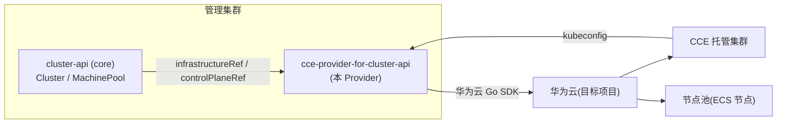

# cloudnative-cluster-api-provider-cce

[](LICENSE)
[](https://www.huaweicloud.com/product/cce.html)
[]()
[]()

> 英文版 / English: [README.md](README.md)

一个用于管理**华为云 CCE(云容器引擎)托管集群**的 Cluster API(CAPI)基础设施 Provider——通过标准的 Cluster API 资源以声明式方式创建、扩缩容和删除 CCE 集群与节点池,对标 `CAPI + AWS EKS 托管模式` 的使用体验。

本项目面向平台工程师与 SRE 团队,帮助他们用 Kubernetes 原生、适合 GitOps 的工具链(`kubectl` / `clusterctl` / ArgoCD / Flux)管理华为云 CCE 集群,就像今天管理 AWS EKS 集群一样。

> **状态:incubating(设计阶段)。** 架构设计与需求设计文档已完成,实现尚未开始。参见 [docs/](docs/) 与[需求文档](docs/requirements-design.md)中的路线图。

## 目录

- [概述](#概述)
- [架构](#架构)
- [方案亮点](#方案亮点)
- [涉及云服务与费用](#涉及云服务与费用)
- [前置条件](#前置条件)
- [快速开始](#快速开始)
- [分步部署](#分步部署)
- [使用方法 / 验证](#使用方法--验证)
- [清理资源](#清理资源)
- [详细文档](#详细文档)
- [依赖与致谢](#依赖与致谢)
- [FAQ / 故障排除](#faq--故障排除)
- [贡献指南](#贡献指南)
- [许可证](#许可证)
- [联系方式 / 维护者](#联系方式--维护者)

## 概述

`cloudnative-cluster-api-provider-cce` 将 Cluster API 对象(`Cluster`、`MachinePool`)翻译为华为云 CCE API 调用,使您可以:

- 创建 CCE 托管集群(控制面由华为云托管)——支持 **CCE Standard** 与 **CCE Turbo**;
- 通过 `MachinePool` 管理 CCE 节点池(修改 `replicas` 即可扩缩容);
- 通过 `clusterctl get kubeconfig` 获取工作集群的 kubeconfig。

它遵循 CAPI Provider 合约(namespace 级 CRD、版本标签、`status.conditions`、finalizer、`clusterctl` 打包),并按照华为云解决方案开发者套件治理规范发布(见 [CONTRIBUTING.md](CONTRIBUTING.md) 与 [docs/](docs/))。

## 架构



设计细节:参见 [docs/architecture-design.md](docs/architecture-design.md) 与 [docs/research-sources.md](docs/research-sources.md)(每个设计决策背后的事实依据)。

## 方案亮点

- **声明式管理托管集群**——CCE 控制面完全由华为云托管,Provider 只负责翻译与调谐。
- **CCE Standard + CCE Turbo 双支持**——两者都支持(默认推荐 Turbo,与 EKS 托管定位对齐)。
- **MachinePool ↔ 节点池**——通过 `MachinePool.spec.replicas` 扩缩容;托管节点池无需 bootstrap provider。
- **兼容 `clusterctl`**——`metadata.yaml` + `infrastructure-components.yaml` 打包(进行中),支持 `clusterctl describe cluster` / `get kubeconfig`。
- **GitOps 就绪**——通过 ArgoCD/Flux 从 Git 全流程驱动。

## 涉及云服务与费用

| 服务 | 用途 | 费用说明 |
|---|---|---|
| CCE(云容器引擎) | 托管 Kubernetes 集群(Standard/Turbo) | 默认按需计费(`billingMode: 0`);空集群也可能产生费用,请以价格页为准 |
| ECS(弹性云服务器) | 工作节点(由 CCE 节点池管理) | 按节点计费,见节点池 `flavor` / `billingMode` |
| VPC / 子网 | 集群与节点的网络 | 由用户提供/引用;出网可能需要 NAT/EIP |
| (可选)EIP / ELB | 公网访问 API Server | 仅当开启 `endpointAccess.public` 时 |

> 测试集群使用后务必清理(见[清理资源](#清理资源)),避免持续计费。

## 前置条件

- 华为云账号,且 IAM 用户/委托具备 Provider 所需的 CCE 权限(见 [docs/requirements-design.md](docs/requirements-design.md) §8.1 与[验证清单](docs/research-sources.md)——**最小权限集合仍需与华为云确认**)。
- 已有 VPC 和子网(CCE 创建集群前必须存在 VPC)。
- 一个 Kubernetes 管理集群(`kind` 或专用集群),已安装 `clusterctl` v1.x。
- 已为管理集群配置 `kubectl`。

## 快速开始

> Provider 正在开发中;以下流程在发布版本后即可执行。凭证**只能**通过环境变量提供——切勿硬编码。

```bash
# 1. 在管理集群上安装 Provider
export CCE_ACCESS_KEY=... CCE_SECRET_KEY=...
clusterctl init --infrastructure cce

# 2. 应用工作集群清单(实现完成后参见 config/samples/)
kubectl apply -f cluster-template.yaml
```

## 分步部署

1. 为目标项目准备凭证 Secret(推荐每集群一个):

   ```bash
   kubectl create secret generic my-cluster-credentials \
     --namespace default \
     --from-literal=accessKey="$CCE_ACCESS_KEY" \
     --from-literal=secretKey="$CCE_SECRET_KEY"
   ```

2. 创建工作集群定义(Cluster + CceCluster + CceManagedControlPlane + MachinePool + CceManagedMachinePool)。样例计划放在 `config/samples/`。

3. 应用并观察:

   ```bash
   kubectl apply -f workload-cluster.yaml
   kubectl get cluster --watch
   ```

4. 当 `Phase` 变为 `Provisioned` 后,获取 kubeconfig(见[使用方法 / 验证](#使用方法--验证))。

## 使用方法 / 验证

```bash
# 验证集群健康
clusterctl describe cluster my-cluster

# 获取工作集群 kubeconfig
clusterctl get kubeconfig my-cluster > my-cluster.kubeconfig
kubectl --kubeconfig my-cluster.kubeconfig get nodes
```

预期结果:`kubectl get nodes` 显示的节点数等于 `MachinePool.spec.replicas`,且全部 `Ready`。

## 清理资源

```bash
# 删除工作集群(删除 CCE 集群、节点池与 Provider 持有的资源)
kubectl delete cluster my-cluster

# 可选:从管理集群卸载 Provider
clusterctl delete --infrastructure cce
```

> 删除 `Cluster` 对象会触发依赖删除(节点池 → 集群 → kubeconfig Secret)。删除后在 CCE 控制台确认无 EIP/EVS/ELB 残留。

## 详细文档

- [架构设计文档](docs/architecture-design.md)
- [需求设计文档](docs/requirements-design.md)
- [调研依据与事实清单(含验证清单)](docs/research-sources.md)
- [CAPA 源码分析报告](docs/CAPA架构分析报告.md) · [阿里云 ACK Provider 源码分析报告](docs/ACKProvider架构分析报告.md) · [CAPHW 源码分析报告](docs/CAPHW架构分析报告.md)

## 依赖与致谢

- [Cluster API](https://cluster-api.sigs.k8s.io/)(`sigs.k8s.io/cluster-api`)——核心合约与控制器。
- [controller-runtime](https://github.com/kubernetes-sigs/controller-runtime)——Reconciler 框架。
- [华为云 Go SDK](https://github.com/huaweicloud/huaweicloud-sdk-go-v3)——CCE/ECS/VPC 客户端。
- 参考实现:[cluster-api-provider-aws](https://github.com/kubernetes-sigs/cluster-api-provider-aws)、[alibabacloud-provider-for-Cluster-API](https://github.com/AliyunContainerService/alibabacloud-provider-for-Cluster-API)、[cluster-api-provider-huawei](https://github.com/huaweicloud-samples/cluster-api-provider-huawei)。

## FAQ / 故障排除

- **集群创建报网络错误**——CCE 要求先有 VPC,且容器/服务网段不能冲突;请检查 `spec.network` 与网段规划(见 [docs/architecture-design.md](docs/architecture-design.md) §6)。
- **节点池不扩缩容**——确认控制面已 `Ready`(节点池只有在集群 `Available` 后才能创建),且 IAM 用户具备 `cce:nodepool:scale` 权限。
- **`clusterctl get kubeconfig` 返回的 server 不可达**——私网集群的 kubeconfig server 是内网地址,请确保管理集群能访问。
- 更多:[docs/requirements-design.md](docs/requirements-design.md) §8(注意事项)与[验证清单](docs/research-sources.md) §4。

## 贡献指南

参见 [CONTRIBUTING.zh-CN.md](CONTRIBUTING.zh-CN.md)。所有提交必须带 DCO 签名(`git commit -s`)。

## 许可证

本项目采用 [MIT No Attribution(MIT-0)](LICENSE) 许可证。

## 联系方式 / 维护者

- 维护者:<your-team@huaweicloud.com>(占位——仓库创建时更新)
- 交流渠道:GitHub Issues / [华为云开发者社区](https://developer.huaweicloud.com/)
